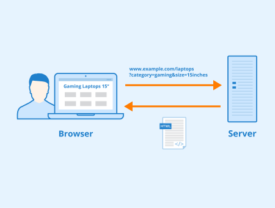

## HTML - What is it?

HTML standands for HyperText Markup Language. And webpages are built using it.

Webpages and thus websites are built with multiple languages, that enable different tasks to be performed.

A website is split between "front end" and "back end" functionality. A the backend, functions are run so that information to captured or delivered to the front end. These functions might operate
with databases, or other applications.

The front end is all about the display of information, and user interface that allows the user to trigger functions and events, or input and output data.

HTML is a markup language, which means it defines in a document how information is displayed on a page e.g. where to position an image and how large.

HTML can't process data, or tell a computer what to do. It onyl informs a browser how to render information on a page.

For the purpose of this tutorial and going forward, whenever we utilise HTML we are using the HTML5 standard.

## URLs?

An URL is a "uniform resource locator", and informs a browser where to look on the internet, or on a local machine, where to find a webpage or some other resource such as a file, an image, music, etc.

Our browser is the "client" and interprets the information that is sent back by the "server" which the URL targets.

||
|:--:|
|<b>Figure: GET Parameters - Author: Seobility - License: CC BY-SA 4.0</b>|

The data between the client and server are sent using HTTP - HyperText Transfer Protocol.

When the HTML document is returned, the browser reads the entire file to establish the "DOM" - the Document Object Model. This represents the page as nodes and objects and how they are interlinked, so that programming languages can interact with the webpage and the data within.

## Development Tools?

Most browsers have built in development tools. These allow you to inspect the webpage and how the HTML defines the elements of it, and how the webpage is styled and structured.

The tool also allows us to inspect how the browser is communicating with ther server, and more.

On Edge this can be opened using "cntrl+shift+I".

If we have the tool open and refresh the page, the network panel  will list all the resources that the HTML of the webpage requests e.g. images, document fragments, or functions that are run.

Selecting a URL in the list brings up further information, such as information about the file, the response headers, and from this we can analysis our webpages and determine why things are going wrong if there are errors.

## My First Webpage!
~~~
<!DOCTYPE html>
<html>
    ...
</html>
~~~
{: .language-html}


What does the above mean?

The opening ```<!DOCTYPE html>``` informs the client how to interpret the file, i.e. it's a HTML file.

The next part of the file is wrapped by the HTML tag ```<html>```. We will explain tags later. But what is important about this tag is that it denotes
which part of the file is html markup lanugage that needs to be interpreted to form the DOM.

The simplest webpage we can make is one that has some text.

~~~
<!DOCTYPE html>
<html>
  <head>
    <title>Welcome to my Webpage!</title>
  </head>
  <body>
    <p><b>My first Webpage</b></p>
  </body>
</html>
~~~
{: .language-html}


> ## How do we add more text in a new paragraph?
>
> How do we add more text but not in bold font?
>
> > ## Solution 
> > ~~~
> >    <!DOCTYPE html>
> >    <html>
> >    <head>
> >        <title>Welcome to my Webpage!</title>
> >    </head>
> >    <body>
> >        <p><b>My first Webpage</b></p>
> >        <p>Some text explaining the webpage<p>
> >    </body>
> >    </html>
> > ~~~
> > {: .language-html}
> > 
> {: .solution}


